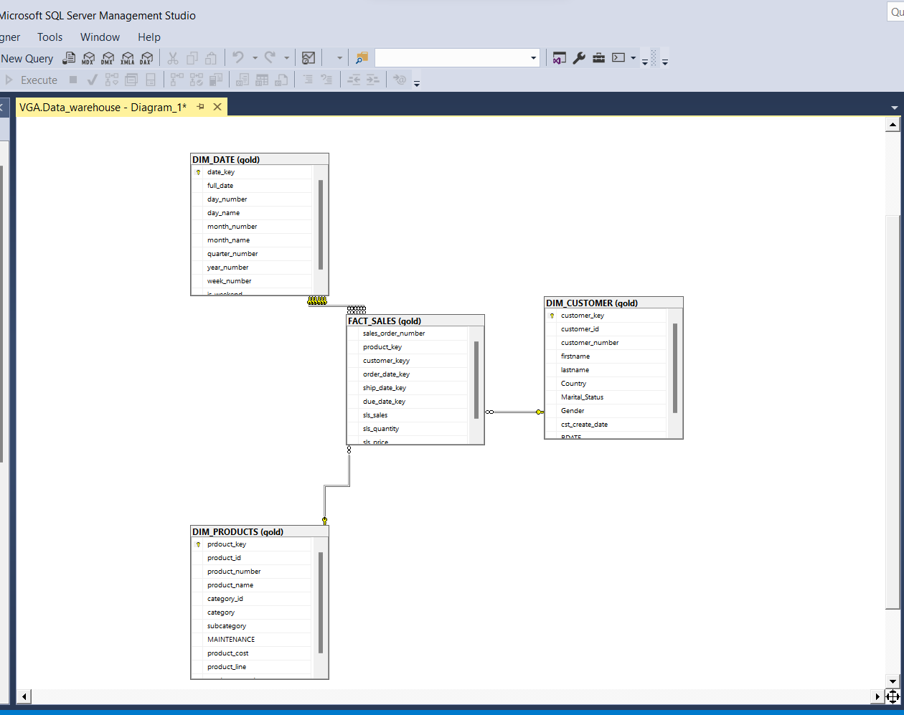

# Data Warehouse Project (SQL Server)

An end-to-end data warehouse built on SQL Server, following the **Medallion Architecture** (Bronze → Silver → Gold). The project takes raw CRM and ERP data, cleans and standardizes it, and models it into a star schema ready for analytics and reporting.

## Architecture



The warehouse is organized into three layers:

| Layer | Purpose |
|-------|---------|
| **Bronze** | Raw data ingested as-is from source CSV files (CRM + ERP), loaded via `BULK INSERT`. No transformations. |
| **Silver** | Cleaned, standardized, and deduplicated data. Business rules applied (e.g. gender/marital status mapping, date validation, sales recalculation). |
| **Gold** | Business-ready star schema — dimension and fact tables, plus a view for direct querying. |

## Data flow

```
CRM (CSV)  ┐
           ├──▶ Bronze layer ──▶ Silver layer ──▶ Gold layer ──▶ Analytics & BI
ERP (CSV)  ┘
```

## Project structure

```
├── DDL_DATAWAREHOUE.sql   # Schema and table definitions for bronze, silver, and gold layers
├── bronze.sql             # Stored procedure: loads raw CRM/ERP CSVs into the bronze layer (BULK INSERT)
├── sliver_layer.sql       # Stored procedure: cleanses and transforms bronze data into the silver layer
├── gold_layer.sql         # Builds the star schema (DIM_CUSTOMER, DIM_PRODUCTS, DIM_DATE, FACT_SALES) and a reporting view
└── Star_Schema.png        # Visual diagram of the gold layer star schema
```

## Data sources

- **CRM**: `cust_info`, `prd_info`, `sales_details`
- **ERP**: `CUST_AZ12` (customer demographics), `LOC_A101` (customer location), `PX_CAT_G1V2` (product categories)

## Silver layer highlights

- Deduplication using `ROW_NUMBER()`, keeping the most recent record per customer
- Text trimming and standardization of categorical values (e.g. `M`/`F` → `Male`/`Female`)
- Date validation and null handling for order, ship, and due dates
- Recalculation of `sales` and `price` when raw values are missing, zero, or inconsistent
- Merging customer attributes across CRM and ERP into a single consistent view

## Gold layer model

A star schema with:

- **`DIM_CUSTOMER`** — merged customer profile (CRM + ERP demographics + location)
- **`DIM_PRODUCTS`** — product catalog with category and subcategory
- **`DIM_DATE`** — generated calendar dimension for time-based analysis
- **`FACT_SALES`** — sales transactions linked to all dimensions

## How to run

1. Run `DDL_DATAWAREHOUE.sql` to create the `bronze`, `sliver`, and `gold` schemas and their tables.
2. Update the CSV file paths in `bronze.sql` to match your local data folder, then execute it to load the bronze layer.
3. Run `sliver_layer.sql` to populate the cleansed silver layer.
4. Run `gold_layer.sql` to build the star schema and the reporting view.

## Tech stack

- SQL Server / T-SQL
- Stored Procedures
- Star Schema data modeling
- Medallion Architecture (Bronze / Silver / Gold)

## Author

**Karim Gaafar**
